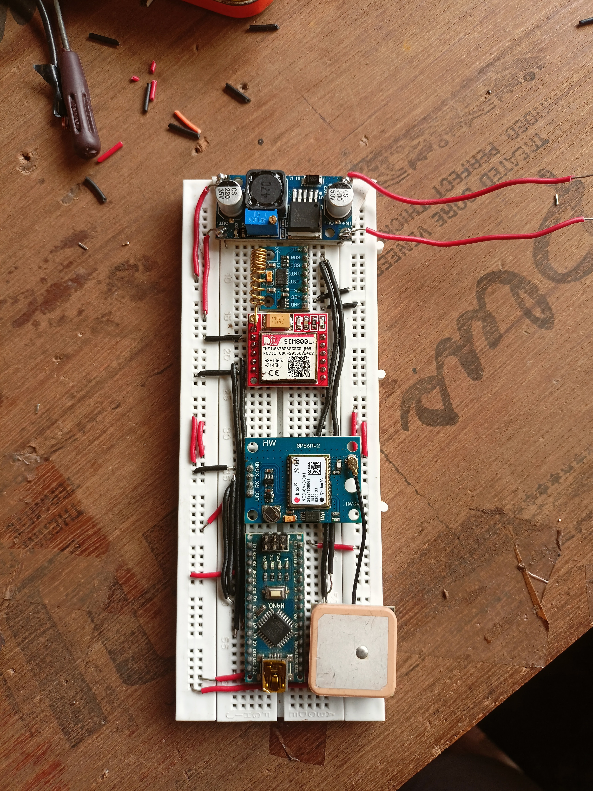

# Accident Detetcion and SOS System
 It is an arduino program which utilizes an accelerometer to detect an accident and uses a GSM module to send an SOS message to a phone number associated with the driver of the vehicle.
 The accelerometer module used is ADXL345.
 The GSM module used in NEO 6M.

 The prototype is shown below:
